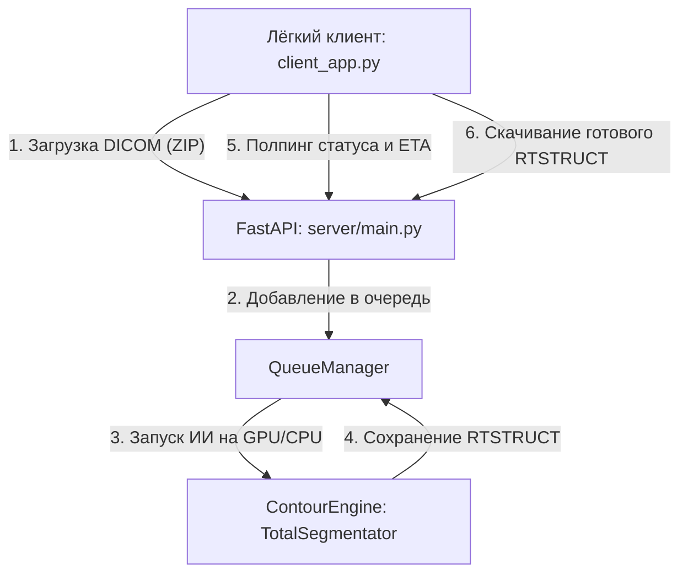

# AI Contour (Краснодар) — Система автооконтурирования органов риска (OAR)

Программное обеспечение **AI Contour** переведено на современную **клиент-серверную архитектуру**, что позволяет выносить ресурсоемкие ИИ-вычисления (TotalSegmentator) на выделенный сервер с мощной видеокартой (GPU), предоставляя пользователям легкий и отзывчивый кроссплатформенный клиент.

---

## 🏗️ Архитектура системы



1. **Клиентская часть (`client_app.py`):**
   * Легковесное PyQt6-приложение с интуитивно понятным интерфейсом.
   * Позволяет выбрать папку с КТ-снимками DICOM, просмотреть слайсы во встроенном 2D-вьювере, выбрать необходимый анатомический пресет.
   * Архивирует снимки в фоновом режиме и отправляет по REST API на сервер.
   * Получает обратно готовый файл `RTSTRUCT`, позволяя накладывать созданные контуры прямо на КТ во встроенном вьювере или объединять результаты.

2. **Серверная часть (`server_app.py` + `server/`):**
   * **`server/main.py`** — высокопроизводительный REST API сервер на FastAPI (порт 8000 по умолчанию).
   * **`queue_manager.py`** — потокобезопасная очередь задач с поддержкой приоритетов, паузы, отмены и расчета времени окончания (ETA) на базе фонового воркера.
   * **`contour_engine.py`** — вычислительное ядро системы. Производит конвертацию DICOM -> NIfTI, выполняет сегментацию TotalSegmentator (с GPU ускорением CUDA), производит 3D-постобработку (сглаживание Гаусса, удаление мелких артефактов) и формирует выходной DICOM `RTSTRUCT` через rt-utils.
   * **`server_app.py`** — GUI-монитор для администратора сервера. Отображает текущую очередь задач в реальном времени, подробные логи выполнения и детализированную интерактивную статистику работы.

---

## ⚡ Быстрый старт и Запуск

### 1. Подготовка окружения
Убедитесь, что у вас установлен Python версии 3.10 или новее.

```powershell
# Создание виртуального окружения
python -m venv venv

# Активация окружения (Windows PowerShell)
.\venv\Scripts\Activate.ps1

# Установка зависимостей
pip install -r requirements.txt
```

> [!NOTE]
> Для работы с GPU-ускорением на сервере должна быть установлена видеокарта NVIDIA с поддержкой CUDA и соответствующие библиотеки PyTorch с поддержкой CUDA (`pip install torch torchvision --index-url https://download.pytorch.org/whl/cu121`).

### 2. Запуск сервера AI Contour
Серверную часть (API + Монитор очереди) можно запустить одной командой:
```powershell
python server_app.py
```
FastAPI запустится в фоновом режиме на `http://127.0.0.1:8000`. Монитор очереди отобразит статус готовности.

### 3. Запуск клиента AI Contour
Запустите клиентское приложение на любом ПК в той же локальной сети:
```powershell
python client_app.py
```

---

## ⚙️ Настройки и Безопасность

* **Пароль администратора:** Для изменения адреса подключения к серверу или перенастройки сетевых параметров на клиенте, нажмите кнопку **«🔑 Настройки соединения (Администратор)»** во вкладке «Настройки» и введите пароль:
  ```text
  rtp
  ```
* **Пресеты и цвета:** Все конфигурационные файлы перенесены в структурированную директорию `config/`:
  * `config/presets/` — JSON-файлы с анатомическими группами органов.
  * `config/colors.json` — RGB палитры отображения контуров.
  * `config/translations.json` — переводы названий структур на русский язык.
  * `config/statistics.json` — глобальный лог запусков и показателей времени.

---

## ⚠️ Медицинский Дисклеймер (Disclaimer)

> [!WARNING]
> Данное программное обеспечение предоставляется исключительно для научных и исследовательских целей (**Research Use Only**). 
> Автоматически сгенерированные контуры органов риска **не являются утвержденной клинической разметкой**. 
> Любые импортированные структуры **подлежат обязательному ручному контролю, валидации и коррекции** квалифицированным медицинским физиком или радиационным онкологом в системе дозиметрического планирования (TPS) перед облучением пациента.
